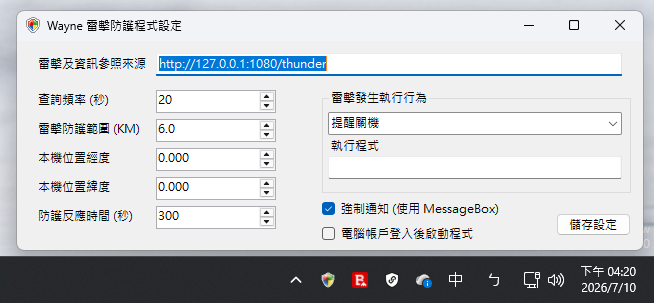

# thunderClient-winstl

Wayne's Thunder Detection and Protection for Windows / Wayne 雷擊偵測防護程式 - Windows 個人版

---

要下載預先編譯好 (For Windows x64 / .NET 8.0 執行階段已經包含) 的版本，請直接到 [Release](https://github.com/tlchiu40209/thunderClient-winstl/releases) 下載。

解壓縮後即可使用。

---

Wayne 雷擊防護程式的開發是來自於本人數次管理中小校園內個人電腦時因雷擊導致隻大量損失，以此作為靈感而開發的程式。程式會定時向 **指定參照資訊來源** 讀取雷擊資料，進而判斷是否需要關機，或提醒使用者等。

程式平時只會常駐於 Windows 系統欄內，並定時向雷擊資訊參照來源查詢雷擊資料。

---

## 系統需求

至少需要 Microsoft Windows 7 SP1 SSU 2019 以上或更新

必須有網路存取 (至少能連線到資料查詢)

---

## 簡易手冊

[雷擊及參考資訊來源設定](./documentation/dataOrigin.md )

[經緯度設定與範圍](./documentation/lonlat.md)

[防護反應時間 (秒)](./documentation/timecheck.md)

[雷擊發生執行行為與通知方式](./documentation/action.md)
