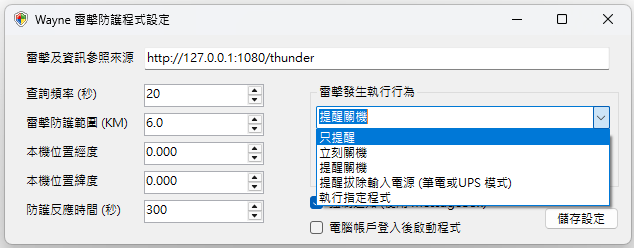

# 雷擊發生執行行為

當程式偵測到雷擊發生時，您可以設定程式執行幾種行為:

- **只提醒:** 程式 **只會顯示** 有雷擊發生，**不會執行任何動作**

- **立刻關機:** 程式 **會顯示提醒** 並提供 **10秒** 時間讓使用者儲存資料與設定

- **提醒關機**: 程式 **會詢問要不要關機** 並 **沒有任何倒數**

- **提醒拔除輸入電源:** 程式 **會顯示提醒拔除 AC 電源**，**不會執行任何動作**

- **執行指定程式:** 程式 **會執行** 下方路徑所指向的 **可執行檔 (.exe / .bat / .cmd)**

## 通知方式

系統提供兩種通知方式:

- **強制通知:** 會在 **螢幕中央跳出對話方塊**，這會 **影響所有全螢幕程式**，**玩遊戲、或者是執行特殊 DOS 模擬環境 (e.g., 倚天模擬系統) 不建議使用。**

- 一般通知: 只會在右下角系統欄跳出提醒。**請注意: 提醒關機不適用。**

