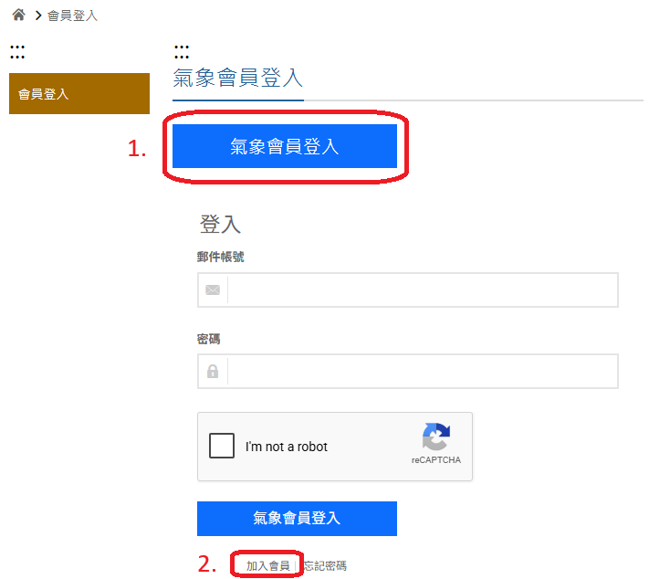
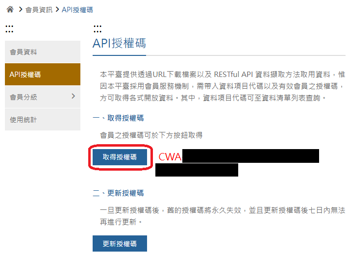
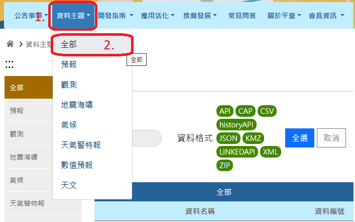
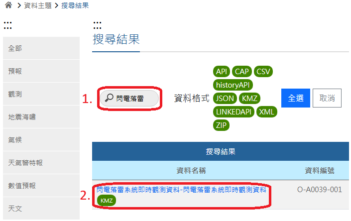
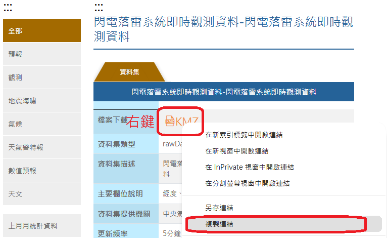
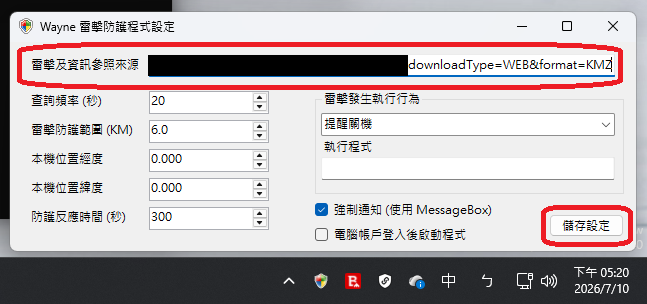

# 雷擊及參考資訊來源設定

雷擊及資訊參照來源只能接受以下兩種格式:

- **中央氣象局閃電落雷系統即時觀測資料-閃電落雷系統即時觀測資料** 的 **.kmz** 或 **.kml** 資料格式

- 其他資料來源不支援

---

## 個人用戶資料取得設定

若為個人使用，您可至 [中央氣象局氣象資料開放平台](https://opendata.cwa.gov.tw) 取得資料來源，以下為設定過程:

**1. 註冊氣象會員**

進入網站後，點選[登入/註冊](https://opendata.cwa.gov.tw/userLogin)，點選 **氣象會員登入** 下拉找到 **加入會員**，並且依照畫面說明進行註冊。如果您需要詳細說明，可參閱[小狐狸事務所: 註冊註冊氣象資料開放平台會員與取得 API 授權碼](https://yhhuang1966.blogspot.com/2024/01/api_18.html)，**僅需註冊完成並登入即可**

**2. 取得授權碼**

**請注意** 授權碼是 **每人存取氣象局資料的唯一認證，您需要妥善保存此碼，並且嚴禁與他人共享!**

第一次登入者需要 **點選取得授權碼**，否則系統不會產生。

**3. 取得雷擊資料**

點選 **資料主題** -> **全部**，並且搜尋 **閃電落雷**，找到 **[[閃電落雷系統即時觀測資料-閃電落雷系統即時觀測資料](https://opendata.cwa.gov.tw/dataset/all/O-A0039-001 "前往閃電落雷系統即時觀測資料-閃電落雷系統即時觀測資料詳細頁")]**

**4. 取得連結**

**5. 測試用資料點** 

如果您只想要試用，您可以使用以下測試點 (非 24 小時上線)

[https://tools.waynechiu.cc/api/thunder](https://tools.waynechiu.cc/api/thunder)

**重要資訊: 中央氣象局開放資料平台每天每授權碼有 20,000 次的存取限制，且該資料集每五分鐘才更新一次，設定過度密集的查詢頻率只會浪費您的電腦資源，且非常快的就到達存取限制次數**

---

## 校園或多人辦公室存取建議

