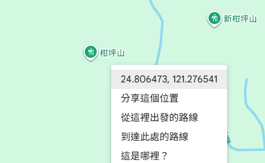

# 經緯度與雷擊防護範圍

中央氣象局所提供的資料皆已 **WGS84** 座標呈現，故您防護設備的**所在地經緯度**也必須使用 **WGS84**，而 **[Google Maps](https://maps.google.com)** 已預設使用 WGS84 座標，**您可以使用它來取得您設備所在地的 WGS84 座標**

您只需要 **找到您目前的位置** 並且 **點選右鍵**，即可取得您的 **WGS84** 座標

**雷擊防護範圍** 是使用您提供的 **WGS84** 經緯度，**畫一個圓**作為防護範圍，**我們不建議設定過小的範圍**，原因如下:

- **地圖仍然有誤差**: 設定過小的範圍只會嚴重收減防護效益

- **氣象局的資料更新是每五分鐘一次**: 足夠大的範圍能提供您足夠的反應時間

