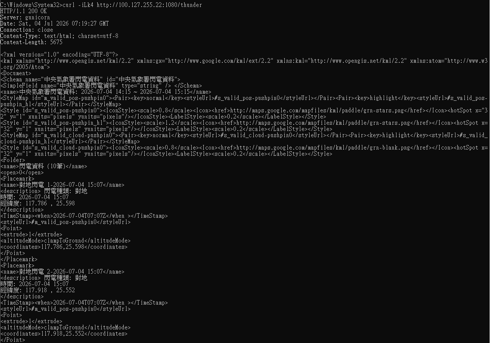

# 防護反應時間

中央氣象局所提供的 kml 資料格式大致如下



範例:

```
<Placement>
    <name>對地閃電 1 2026/07/04 15:07</name>
    <description> 閃電種類: 對地
    時間: 2026/07/04 15:07
    經緯度: 117.785, 25.508
    </description>
    <TimeStamp>
        <when>2026-07-04T07:07Z</when>
    </TimeStamp>
    <styleUrl>#m_valid_pos-pushpin0</styleUrl>
    <Point>
        <extrude>1</extrude>
        <altitudeMode>clampToGround</altitudeMode>
        <coordinates>117.785,25.508</coordinates>
    </Point>
</Placement>
```

由於中央氣象局輸送資料時為**一次一個小時**作為**一次傳送的資料量**，所以假設中央氣象局這次更新資料的時間為 15:15，則查詢時得到的結果是 14:15 - 15:15 之間所有的閃電

**反應防護時間** 是在設定 **從起算時間**往前算**多少秒鐘**內的**閃電資料**仍然必須作為考量

舉個例子: 如果電腦在 15:15 取得資料更新，而反應防護時間設定為 300 秒，**則若資料顯示 15:10 - 15:15 之間有閃電，那就視同現在有閃電，而電腦必須關機**

**預設為 300 秒之原因，是中央氣象局更新的速度就是每五分鐘一次，而五分鐘內如果仍有閃電，我們大概也都能假設雷雨還沒遠去**

這個數值**不建議設定低於 300 秒，因為沒有意義**，但同時**也不建議設定太長 ( 如40 分鐘)**，因為這代表 **電腦程式認定至少要在雷雨結束 40 分鐘之後才算安全。**

您可以設定 **300-900** 秒左右 - 按照您的需求。


